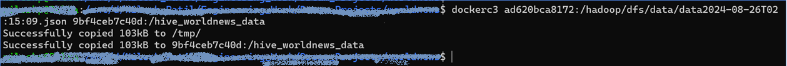
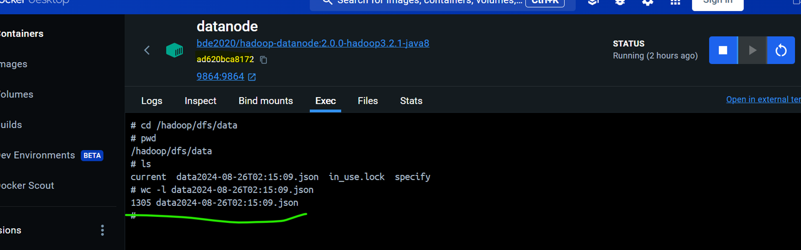
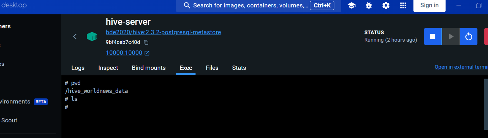
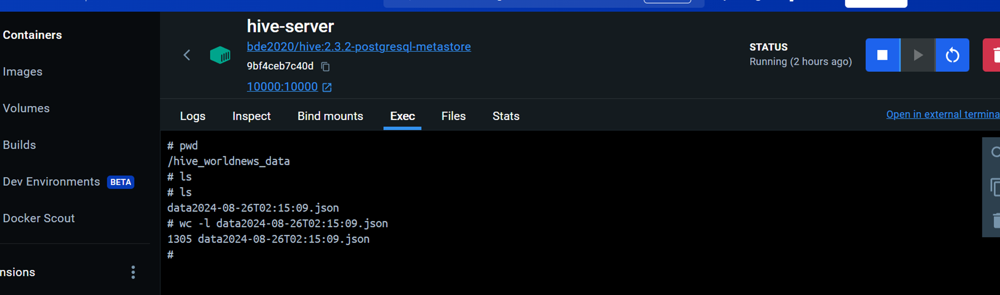

# Docker container to container copying utility


Open new terminal on your computer and login to WSL with username, and go to some radom directory and run below

```
dockerc3 ad620bca8172:/hadoop/dfs/data/data2024-08-26T02:15:09.json 9bf4ceb7c40d:/hive_worldnews_data
```


> [!NOTE]<br/>
> `dockerc3` : <code style="color : red">docker</code> <code style="color : red">c</code>ontainer to <code style="color : red">c</code>ontainer <code style="color : red">c</code>opy, it is a user defined utility. To see how we defined it, go to this [section](#to-treat-dockerc3-as-a-linux-command)<br/>
> `ad620bca8172` : is container id/datanode host name/source<br/>
> `9bf4ceb7c40d` : is container id/hive-server host name/destination

**Before** dockerc3 command was executed:




**After** dockerc3 command was executed:


--------------------------------------------------
<br/>

### To treat dockerc3 as a linux command

Open `.bashrc` file and add following aliases
```
username@myhost:~$ vi .bashrc
```


